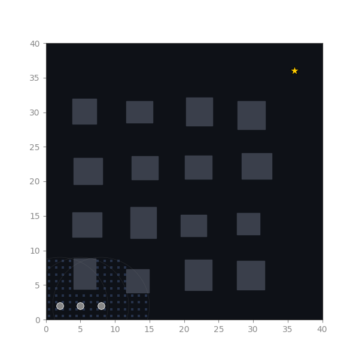
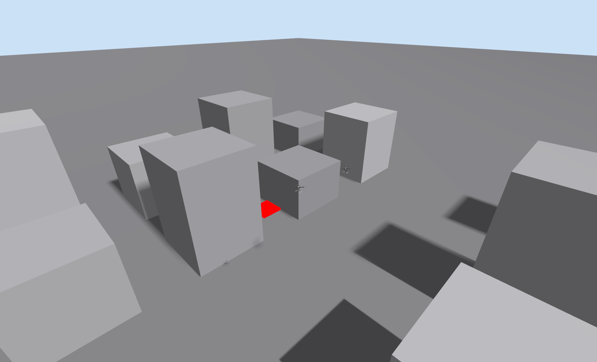

<h1 align="center">Swarm Autonomy</h1>

<p align="center">
  <b>Decentralized multi-drone autonomy for GPS-denied urban search &amp; pursuit.</b><br>
  A swarm of quadrotors that explore an unknown city, build a shared map over a
  bandwidth-limited link, and cooperatively intercept a fleeing target — with
  <b>no central node</b>, each drone running onboard VIO → mapping → planning → control.
</p>

<p align="center">
  <a href="https://github.com/Manas-arumalla/swarm-autonomy/actions/workflows/ci.yml"></a>
  
  
  
  
  
</p>

<p align="center">
  <br>
  <em>Decentralized cooperative pursuit in the headless swarm simulator — pursuers allocate
  containment slots (CBBA), track the fleeing evader through a bandwidth-limited radio link,
  and corner it with no central coordinator. Reproducible with <code>sim/run_sim.py</code>.</em>
</p>

<p align="center">
  <br>
  <em>The same scenario in the full stack — two PX4 SITL x500 quadrotors close on the fleeing
  evader (red) in the Gazebo Harmonic city world, detecting it with their downward cameras and
  coordinating through the gated comms layer. Live capture;
  <code>sim/scripts/run_px4_swarm.sh</code> runs it.</em>
</p>

---

## Overview

Swarm Autonomy is my simulation-grade research platform for **decentralized multi-UAV autonomy**.
Every drone runs the same onboard stack — visual-inertial odometry, occupancy/ESDF mapping, motion
planning, and control — and the swarm coordinates purely peer-to-peer over a modeled,
bandwidth-limited radio. I built it by **integrating proven open-source components** (OpenVINS,
nvblox, ego-planner-swarm, RACER, CBBA) around two cores of my own: a single **inter-drone comms
choke point** that makes "bandwidth-limited radio" a measured quantity, and a **coordination +
pursuit** layer for decentralized role allocation and target interception.

I separate **algorithmic cores** (pure, dependency-free, unit-tested Python) from **ROS 2 node
wrappers**, so the coordination, comms, mapping, and planning logic is verified by **77 unit
tests** and reproduced by headless benchmark scripts that need no GPU and no manual piloting.

## Highlights

- **GPS-denied flight on stereo VIO** — I diagnosed and fixed a vision/state-estimation handover
  divergence; external-vision error held to **0.26 m mean** on VIO alone.
- **Cooperative exploration that scales** — **2.3× faster** city coverage with 3 drones vs. solo,
  and a measured **+27%** penalty when the radio is throttled (coordination is comms-bound).
- **Vision-only cooperative pursuit** — onboard camera detection + decentralized CBBA role
  allocation corner a fleeing evader with no shared ground-truth target feed.
- **Optimal control** — my condensed-QP model-predictive controller tracks a noisy target estimate
  **2.7× smoother** than a reactive baseline.
- **Navigation among buildings** — a CPU ESDF + ego-planner-style optimizer keeps **+0.9 m**
  clearance where straight-line motion would pass **3.6 m through** a building.

## Results

All figures are produced by deterministic, headless scripts under [`experiments/`](experiments/)
and regenerate in under a minute via [`experiments/make_figures.sh`](experiments/make_figures.sh).
Full methodology, metric definitions, and ablations are in
[**docs/benchmarks.md**](docs/benchmarks.md).

| Capability | Metric | Baseline | Swarm Autonomy | Figure |
|---|---|---|---|---|
| GPS-denied VIO handover | EKF2↔vision error (mean) | mono diverges | **0.26 m** | `vio_stereo_handover.png` |
| Cooperative exploration | time to 90% city coverage | 36.6 s (solo) | **15.6 s** (3 drones, 2.3×) | `coop_exploration.png` |
| Comms sensitivity | coverage time, throttled radio | 15.6 s | 19.8 s (**+27%**) | `coop_exploration.png` |
| Navigation among buildings | min. obstacle clearance | −3.6 m (straight line) | **+0.9 m** | `plan_among_buildings.png` |
| Pursuit guidance | command jitter (lower = smoother) | 0.91 (reactive) | **0.34** (MPC, 2.7×) | `control_compare.png` |

### GPS-denied flight on visual-inertial odometry

Monocular VIO under-scales the trajectory by roughly 5× when flight excitation is low (scale is
unobservable), so the GPS→VIO handover diverges. A **stereo camera** restores metric scale, and a
**trajectory-fit (Umeyama) alignment** between the VIO and EKF2 frames cuts the fused external-vision
error to **0.26 m mean / 0.70 m max**. The drone then holds a stable 5 m circle on **vision only**.


### Cooperative exploration over a bandwidth-limited link

Drones sense with occlusion (line-of-sight ray-casting), maintain per-drone occupancy beliefs, and
share map deltas through the gated `swarm_autonomy_comms` link; a decentralized nearest-frontier rule
divides the city. Time to 90% coverage drops from **36.6 s (solo) to 15.6 s (3 drones)**, and a
**throttled radio costs +27%** — the shared map only accelerates coverage when the link can carry it.


### Navigation among buildings

A CPU **Euclidean Signed Distance Field** plus an **A\* front-end / ESDF-gradient elastic-band
back-end** (the ego-planner formulation, on CPU) routes through the city. Straight-line motion
passes **3.6 m inside** buildings; the planner holds **+0.9 m** clearance and stays smooth.


### Pursuit control: MPC vs. reactive

Tracking a noisy camera estimate of a maneuvering target, the condensed-QP MPC produces **2.7×
smoother** velocity commands (jitter 0.91 → 0.34) with fewer reversals and lower tracking error
than a tuned reactive lead-pursuit law.


## Architecture

```
[Gazebo: camera + IMU] → [OpenVINS VIO] → [VIO→EKF2 bridge] → PX4 EKF2 (GPS off)
        │                                                            │ state
        ▼                                                            ▼
 [ESDF / occupancy mapping] ──────────── [map merge] ◀── neighbour deltas ┐
        │ local map                          │ shared map                 │
        ▼                                     ▼                            │  all inter-drone
 [ego-planner / RACER] ◀── goal/role ── [coordination: CBBA] ◀── bids ────┤  traffic passes
        │ trajectory                         ▲                            │  through the
        ▼                            [pursuit] ◀── target obs ────────────┤  comms middleware
 [controller] → PX4 offboard          ▲                                   │  (range/rate/
                              [target detection]                          ┘  dropout + logging)
```

Two architectural principles run through the codebase:

1. **One comms choke point.** All inter-drone traffic flows through
   [`swarm_autonomy_comms`](ros2_ws/src/swarm_autonomy_comms/), which gates on range, rate, and
   dropout and logs bandwidth — making the bandwidth limit a *measured* quantity rather than an
   assumption. The headless simulator gates every message type in-process; the ROS middleware
   brokers all four traffic classes (pose, target, map delta, task bid) from one topic registry.
2. **Pure cores, thin nodes.** Each algorithm (link model, CBBA, pursuit geometry, ESDF, planner,
   PID, Kalman tracker, ORCA-style avoidance) lives in a dependency-free module with plain-pytest
   tests; these cores drive the headless sim and the experiments directly. The logic is verified
   without a simulator in the loop — **77 unit tests**.

> **Implementation status.** The validated, demonstrated capabilities — GPS-denied
> VIO↔EKF2 handover, camera-guided pursuit, cooperative exploration, planning among buildings, and
> every benchmark — run through the **headless simulator** and the **standalone `sim/scripts/*`**
> (PX4 SITL + Gazebo). The **ROS 2 node graph integrates the same cores**: the comms middleware
> brokers all topic types, the map-merge node fuses neighbour deltas into the planning grid, the
> target detector runs the shared blob/back-projection core, the VIO→EKF2 bridge applies the
> validated trajectory-fit alignment with capture-time stamping, and the offboard node follows
> planner routes through the tested PID + frame helpers. End-to-end ROS-graph flight has not yet
> been re-validated live, so the proven flight path remains the standalone scripts. Claims are
> scoped accordingly.

See [**docs/architecture.md**](docs/architecture.md) for the full system design.

## Repository layout

| Path | Contents |
|---|---|
| [`ros2_ws/src/swarm_autonomy_msgs`](ros2_ws/src/swarm_autonomy_msgs/) | Shared message interfaces (poses, map deltas, bids, target observations, comms stats, roles). |
| [`ros2_ws/src/swarm_autonomy_comms`](ros2_ws/src/swarm_autonomy_comms/) | Range/rate/dropout link model + bandwidth-logging middleware. |
| [`ros2_ws/src/swarm_autonomy_coordination`](ros2_ws/src/swarm_autonomy_coordination/) | CBBA role allocation, pursuit/interception geometry, MPC guidance, Kalman target tracker. |
| [`ros2_ws/src/swarm_autonomy_control`](ros2_ws/src/swarm_autonomy_control/) | PX4 offboard PID position controller. |
| [`ros2_ws/src/swarm_autonomy_perception`](ros2_ws/src/swarm_autonomy_perception/) | OpenVINS bringup, VIO→EKF2 bridge, target detection. |
| [`ros2_ws/src/swarm_autonomy_mapping`](ros2_ws/src/swarm_autonomy_mapping/) | CPU ESDF + occupancy grid, frontier detection, map-delta serialization, shared-map merge. |
| [`ros2_ws/src/swarm_autonomy_planning`](ros2_ws/src/swarm_autonomy_planning/) | CPU A\* + ESDF-gradient elastic-band planner; ego-planner-swarm / RACER integration shim. |
| [`ros2_ws/src/swarm_autonomy_bringup`](ros2_ws/src/swarm_autonomy_bringup/) | Launch files, per-drone namespacing, parameters. |
| [`sim/`](sim/) | PX4 SITL + Gazebo worlds and scripts, plus a ROS-free headless swarm simulator. |
| [`experiments/`](experiments/) | Deterministic benchmark scripts → result figures. |
| [`docs/`](docs/) | Architecture, benchmarks, design decisions, engineering notes, sim-to-real. |

## Getting started

The pure-Python cores and all result figures run with no GPU, no ROS, and no simulator:

```bash
# Clone, then regenerate every benchmark figure (headless, < 1 min)
pip install -r requirements.txt
./experiments/make_figures.sh          # writes experiments/plots/*.png

# Run the unit-tested algorithmic cores
python3 -m pytest -q ros2_ws/src/*/test sim/swarm_sim/test
```

Full ROS 2 + PX4 SITL flight (requires `scripts/setup.sh`, which vendors PX4, the uXRCE-DDS
agent, OpenVINS, and the planners):

```bash
source /opt/ros/jazzy/setup.bash
cd ros2_ws && colcon build --symlink-install && source install/setup.bash

sim/launch_sim.sh                                          # PX4 SITL + Gazebo + XRCE agent
ros2 launch swarm_autonomy_bringup multi_drone.launch.py num_drones:=3
```

## Documentation

| Document | Contents |
|---|---|
| [docs/architecture.md](docs/architecture.md) | System architecture, the comms choke point, the pure-core/thin-node pattern, data flow. |
| [docs/benchmarks.md](docs/benchmarks.md) | Evaluation methodology, metric definitions, full results, and ablations. |
| [docs/engineering-notes.md](docs/engineering-notes.md) | Technical deep-dives: the stereo-VIO handover fix and the pursuit-perception investigation. |
| [docs/design-decisions.md](docs/design-decisions.md) | Rationale behind the major component and architecture choices. |
| [docs/sim-to-real.md](docs/sim-to-real.md) | The hardware path: what transfers, what breaks, BOM and timeline. |

## Hardware notes

Mapping (nvblox ESDF) and the RL extension target a 12 GB+ CUDA GPU. Swarm Autonomy ships a fully
unit-tested **CPU implementation** of the ESDF and planner so the mapping and exploration results
above run on any machine; the nvblox GPU backend drops in behind the same `map_merge_node`
interface. See [docs/design-decisions.md](docs/design-decisions.md) for the GPU-budget rationale.

## References

OpenVINS · [nvblox](https://github.com/nvidia-isaac/nvblox) ·
[ego-planner-swarm](https://github.com/ZJU-FAST-Lab/ego-planner-swarm) ·
[RACER](https://github.com/SYSU-STAR/RACER) ·
[FUEL](https://github.com/HKUST-Aerial-Robotics/FUEL) ·
CBBA (Choi, Brunet &amp; How, *IEEE T-RO* 2009) · [PX4 + ROS 2 + Gazebo](https://docs.px4.io)

## License

Released under the [MIT License](LICENSE).
