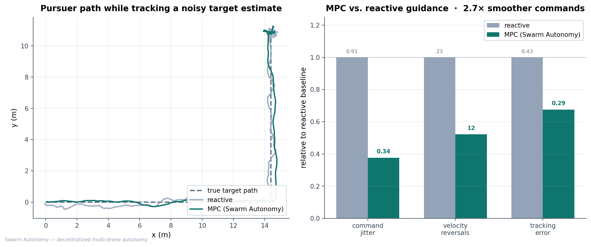
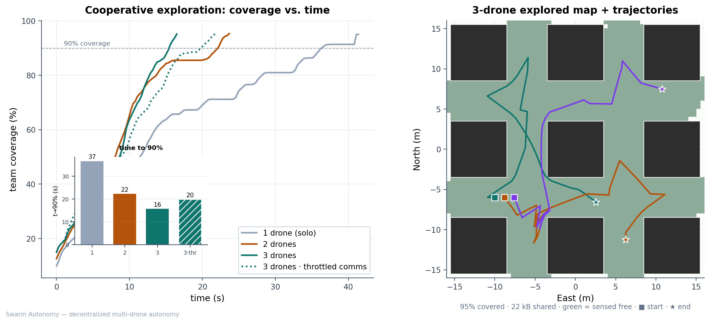
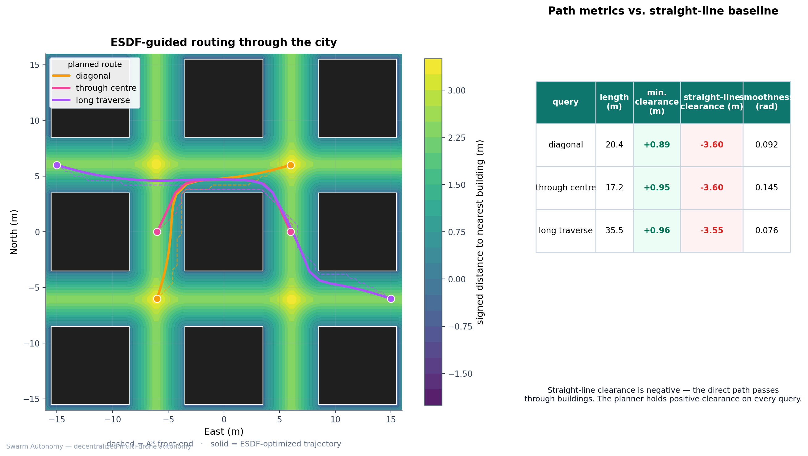
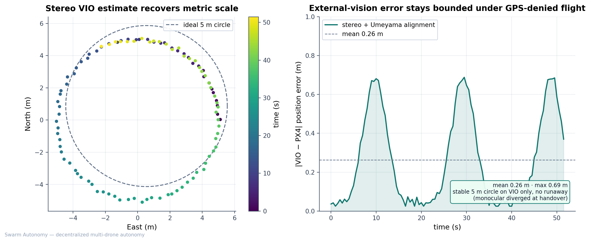

# Benchmarks

This document defines how Swarm Autonomy is evaluated, what each metric means, and the measured results.
Every figure is produced by a deterministic, headless script under [`experiments/`](../experiments/)
or [`sim/benchmarks.py`](../sim/benchmarks.py); all are regenerated together by
[`experiments/make_figures.sh`](../experiments/make_figures.sh) in under a minute, with no GPU, no
ROS, and no manual piloting.

## Methodology

- **Determinism.** Randomness is drawn from explicitly seeded generators, so each benchmark
  reproduces bit-for-bit across machines and CI runs. Sweeps over drone count, evader speed, and
  comms quality vary one factor at a time.
- **Real algorithm modules.** The headless benchmarks exercise the same `link_model`, `cbba`,
  `pursuit`, `esdf`, `planner`, and `target_tracker` modules that run inside the ROS 2 nodes — the
  evaluation is of the shipped code, not a re-implementation.
- **No oracle information.** In the multi-drone benchmarks there is no shared ground-truth map or
  target feed; each drone acts on its own sensing plus whatever survives the modeled radio link.
- **Metrics as plots.** Results are reported as quantitative figures and tables, with baselines and
  ablations rather than adjectives.

## Summary

| Experiment | Metric | Baseline | Swarm Autonomy | Improvement |
|---|---|---|---|---|
| Pursuit guidance (MPC vs reactive) | command jitter | 0.91 | 0.34 | **2.7× smoother** |
| Pursuit guidance | velocity reversals | (reactive) | — | **1.9× fewer** |
| Pursuit guidance | mean tracking error | 0.43 m | 0.29 m | 1.5× lower |
| Cooperative exploration | time to 90% coverage | 36.6 s (1 drone) | 15.6 s (3 drones) | **2.3× faster** |
| Comms sensitivity | coverage time, throttled link | 15.6 s | 19.8 s | **+27% penalty** |
| Navigation among buildings | min. obstacle clearance | −3.6 m (straight line) | +0.9 m | collision-free |
| GPS-denied VIO handover | EKF2↔vision error (mean / max) | mono diverges | 0.26 m / 0.70 m | metric-scale lock |

---

## 1. Pursuit guidance — MPC vs. reactive control

**Setup.** A target follows a cruise → turn → hover trajectory; the controller sees only a noisy
estimate of it (Gaussian jitter, σ = 0.6 m, emulating camera back-projection noise). Two guidance
laws close the loop: a tuned reactive lead-pursuit law with adaptive command smoothing, and a
condensed-QP model-predictive controller (double-integrator model, per-axis box-constrained QP).

**Metrics.** *Command jitter* = mean step-to-step change in the velocity command (lower is
smoother). *Velocity reversals* = sign flips in the command (oscillation count). *Tracking error* =
mean distance to the true target after the transient.

**Result.** The MPC folds the predicted target motion into the present command, producing **2.7×
lower command jitter (0.91 → 0.34)**, **1.9× fewer velocity reversals**, and lower steady-state
tracking error (0.43 m → 0.29 m) — the reactive law oscillates most during the hover phase, exactly
where the MPC stays still.

Reproduce: `python3 experiments/control_compare.py`

## 2. Cooperative exploration and comms sensitivity

**Setup.** *N* drones explore a 32 × 32 m city of nine buildings from a shared launch point. Each
drone senses with a 360° occlusion ray-cast (buildings shadow what is behind them), holds its own
occupancy belief, and periodically broadcasts newly-seen cells; every broadcast is gated by the
`swarm_autonomy_comms` link model (range + i.i.d. loss + token-bucket bandwidth). A decentralized
nearest-unclaimed-frontier rule divides the city, with claims piggybacked on the same gated link.

**Metric.** *Time to 90% coverage* of the truly-free space, sensed by any drone.

**Result — speedup vs. solo.**

| Drones | Time to 90% coverage | Speedup | Map data shared |
|---|---|---|---|
| 1 (solo) | 36.6 s | 1.0× | 0 kB |
| 2 | 22.2 s | 1.6× | 10.1 kB |
| 3 | 15.6 s | **2.3×** | 22.1 kB |

**Ablation — coordination is comms-bound.** Re-running the 3-drone configuration with a *throttled*
radio (1.2 kB/s, 22 m range, 25% loss vs. 50 kB/s, 80 m range, 2% loss) raises the coverage time
from **15.6 s to 19.8 s (+27%)**. The shared map only accelerates coverage when the link can carry
it; when it cannot, drones rediscover each other's ground and coordination degrades gracefully
rather than failing.

Reproduce: `python3 experiments/coop_exploration.py`

## 3. Navigation among buildings

**Setup.** The same city is converted to a CPU occupancy grid and Euclidean Signed Distance Field.
Three start→goal queries that each require weaving between buildings are routed by the planner
(A\* front-end for a collision-free homotopy, then an ESDF-gradient elastic-band back-end that
minimizes smoothness + collision + length). The baseline is the straight line between endpoints.

**Metrics.** *Path length*, *minimum clearance* to any building along the path (signed ESDF, so a
negative value means inside a building), and *mean turn angle* (smoothness).

| Query | Path length | Min. clearance | Straight-line clearance | Smoothness |
|---|---|---|---|---|
| diagonal across centre | 20.4 m | +0.89 m | **−3.60 m** | 0.092 rad |
| through centre building | 17.2 m | +0.95 m | **−3.60 m** | 0.145 rad |
| long city traverse | 35.5 m | +0.96 m | **−3.55 m** | 0.076 rad |

**Result.** The straight-line baseline passes ~3.6 m *inside* a building on every query; the planner
holds **≥ 0.89 m clearance** and stays smooth.

Reproduce: `python3 experiments/plan_among_buildings.py`

## 4. GPS-denied flight on visual-inertial odometry

**Setup.** A drone flies a survey circle in PX4 SITL on stereo OpenVINS VIO. The VIO odometry is
aligned to the PX4 EKF2 frame and fused as external vision; GPS is then disabled and the drone must
hold its trajectory on vision alone.

**Metric.** *External-vision error* = the distance between the aligned VIO estimate and the PX4
state estimate over the flight.

**Result.** Monocular VIO under-scales the circular trajectory by roughly 5× (scale is unobservable
under low linear acceleration), and the handover diverges. A stereo camera restores metric scale,
and a trajectory-fit (Umeyama) alignment of the VIO and EKF2 frames holds the fused error to **0.26
m mean / 0.70 m max**. The drone then maintains a stable 5 m circle on vision only. The full
diagnosis is in [engineering-notes.md](engineering-notes.md).

Reproduce: `python3 experiments/vio_stereo_handover.py` (reads a captured VIO bridge log)

## 5. Swarm-scale sweeps

[`sim/benchmarks.py`](../sim/benchmarks.py) runs the headless swarm simulator across multiple seeds
and produces three scaling figures:

- **`coverage_vs_time.png`** — mean coverage vs. time for 1, 3, 5, and 8 drones (± 1σ over six
  city layouts), run in **pure-exploration mode** (no pursuit phase, no early termination) so every
  curve spans the full 60 s — no forward-filled tails. Map seeds and channel seeds are decoupled.
- **`interception_rate.png`** — a pursuer-count × evader-speed **heatmap** of capture rate (8 maps
  per cell). The speed axis deliberately crosses the pursuers' 4 m/s limit so the kinematic cliff
  is visible rather than averaged away: below the line capture rises with team size toward
  90–100 %; above it, success collapses for small teams and only large teams partially recover it
  through containment geometry (e.g. 6 pursuers still catch a 7 m/s evader on most maps). The
  evader moves from t = 0 (patrols unobserved, flees line-of-sight threats with a full-circle
  escape search), and the drones carry an acceleration limit — both make this sweep harder and more
  representative than a stationary-target, infinite-acceleration setup.
- **`bandwidth_vs_cap.png`** — the **busiest single directed link's** delivered bytes/s against the
  *per-link* cap (an apples-to-apples comparison), with the all-links total for context; mean over
  3 runs, clipped to the shortest run. The token bucket permits a one-off burst of the configured
  bucket capacity, which the first windows may show.

Reproduce: `python3 sim/benchmarks.py`

## Limitations

These benchmarks exercise the **shipped coordination / comms / allocation / pursuit-geometry code**
faithfully (the headless sim imports those modules verbatim), but the vehicle, sensor, and evader
models are abstractions. The absolute numbers are an idealised upper bound, not a hardware
prediction — read them as evidence that the *coordination* works, not as flight performance.

- **Simplified vehicle dynamics.** The headless drone is a velocity-commanded point mass with an
  **acceleration limit** (no instant reversals), but still no attitude loop, drag, or thrust
  dynamics — PX4/Gazebo add those. The coordination logic transfers; the timing numbers remain
  optimistic relative to hardware, just no longer infinitely so.
- **Greedy evader.** The evader moves from t = 0 and searches a full-circle escape cone, but its
  policy is one-step lookahead — a smarter adversary (multi-step rollout, path memory) would lower
  the capture rates further.
- **Coverage uses the sim's own sensing, not the ESDF stack.** Cooperative-exploration coverage is
  produced by the headless simulator's line-of-sight occupancy model (resolution-dependent), not
  the shipped `swarm_autonomy_mapping` ESDF. It demonstrates the coordination/comms benefit, not
  the deployed mapping pipeline.
- **CPU clearance is slightly conservative.** The CPU ESDF measures cell-centre distances, so
  reported clearance is biased low by ~½ voxel (the safe side).
- **Pursuit precision is sensor-bound, not coordination-bound.** With monocular downward cameras,
  the swarm follows the evader within a few metres rather than locking on exactly. Ground-truth
  instrumentation showed this is the accumulated precision of vision-only pursuit (ground
  back-projection from a distance, fast relative motion) rather than a coordination or calibration
  defect — a stereo or gimballed sensor would tighten it. See
  [engineering-notes.md](engineering-notes.md) for the full investigation.
- **Mapping/planning use the CPU implementation.** The ESDF and planner results above run on CPU;
  the nvblox GPU backend is an interface-compatible drop-in, not yet benchmarked here.
- **Simulation only.** Camera/IMU noise, radio PHY latency, and compute budget differ on hardware;
  the transfer path is analyzed in [sim-to-real.md](sim-to-real.md).
